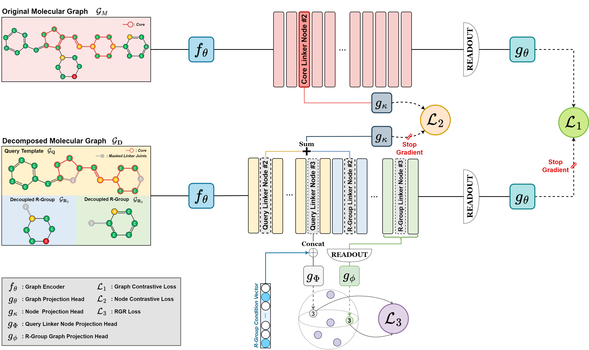

# MolPLA 



## Abstract (submitted to ISMB 2024 Proceedings Track)

Molecular core structures and R-groups are essential concepts in drug development. Integration of these concepts with conventional graph pre-training approaches can promote deeper understanding in molecules. We propose MolPLA, a novel pre-training framework that employs masked graph contrastive learning in understanding the underlying decomposable parts in molecules that implicate their core structure and peripheral R-groups. Furthermore, we formulate an additional framework that grants MolPLA the ability to help chemists find replaceable R-groups in lead optimization scenarios. Experimental results on molecular property prediction show that MolPLA exhibits predictability comparable to current state-of-the-art models. Qualitative analysis implicate that MolPLA is capable of distinguishing core and R-group sub-structures, identifying decomposable regions in molecules and contributing to lead optimization scenarios by rationally suggesting R-group replacements given various query core templates.


## How to run the experiments 

### Step 1. Edit the confguration file **settings.yaml**.
```
example:
  dev_mode: 
    debugging: 
    toy_test: 

  wandb:
    project_name: example_project_name
    session_name: example_session_name
    group_name: 

  ddp:
    port: 13000

  path:
    dataset: /path/to/folder/named/datasets
    checkpoint: /path/to/folder/named/checkpoints

  dataprep:
    dataset: geom
    version: v11
    subsample: 1.0

  experiment:
    testing_mode: false
    random_seed: 911012
    which_best: loss

  model_params: 
    model_type: molpla
    hidden_dim: 300
    dropout_rate: 0.0
    graph_encoder: GNN
    gnn_params:
      aggr: add
      JK: concat
      gnn_type: gin
      num_layer: 3

    graph_pooling: add
    graph_projector: mlp
    link_decoder: mlp

    stop_gradient_arms:    False
    stop_gradient_core:    False
    separate_linker_nodes: False

    prop_conditioned: arms

    faiss_metric: inner_product

  train_params:
    batch_size: 4096
    num_epochs: 200

    optimizer: adam
    scheduler: CyclicLR

    learning_rate: 0.00001
    weight_decay: 0.0

    early_stopping: loss
    early_patience: 30

    pretraining:
      main_graph_contrastive:
        loss_coef: 0.1
        score_func: dualentropy
        tau: 0.1
      dcpd_graph_contrastive:
        loss_coef: 0.1
        score_func: dualentropy
        tau: 0.05
      linker_node_contrastive:
        loss_coef: 0.8
        score_func: dualentropy
        tau: 0.01

example_bench:
  dataprep:
    dataset: 
    version: 
    subsample:

  experiment:
    testing_mode: false
    random_seed: 8888
    which_best: loss

  model_params:
    dropout_rate: 0.1

  train_params:
    batch_size: 256
    num_epochs: 100

    optimizer: adam
    scheduler: dummy

    learning_rate: 0.0001
    weight_decay: 0.0

    early_stopping: 
    early_patience: 100

    finetuning:
      from_pretrained:   pretrained_geom_v11
      freeze_pretrained: False
```

- Possible arguments for 
  - **example.model_params.model_type**: ```molpla```
  - **example.train_params.scheduler**: ```dummy```, ```CyclicLR```
  - **example.train_params.pretraining.linker_node_contrastive**: ```dualentropy```
- All experiment reports are uploaded to your WANDB account. 
- You can download the datasets from our Google Drive. Current version is ```v11```.

### Step 2. Run the following script
```
python run.py -sn main -mg {GPU indices separated by comma}

```

- This script will pretrain the molecule representation model and then perform benchmark experiments (finetune-and-test) on various molecule property prediction datasets including *freesolv*, *lipophilicity*, *esol*, *toxcast*, *tox21*, *sider*, *bbbp*, *bace* and *clintox*.
- If you want to skip the pretraining phase, add *-sp* to the above script.
- If you want to run only the pretraining code to either adjust the hyperparameters or look into the **R-Group Retrieval Task**, run this code instead.

```
python run_pretrain.py -sn example -mg {GPU indices separated by comma}

```


### Downloading the Preprocessed Dataset and Pretrained Model

- The dataset contains all pre-processed data that was used to pre-train MoLPLA and perform benchmark test on molecule property prediction
- [DATASET (10GB)](https://drive.google.com/file/d/1sgWVvZ3ln56D9GP7u5VoUhoP4MD0IQTR/view?usp=sharing)
- This repository in Google Drive contains all the files including the model checkpoints containing pre-trained parameters. Note that you might have to edit the directory configuration inside **model_config.pkl**.
- [MODEL CHECKPOINT (best_loss.mdl)](https://drive.google.com/drive/folders/1fEtaPKuwDihHAprxQgWg2eKPXtNCi5xv?usp=drive_link)


## Contributors

<table>
	<tr>
		<th>Name</th>		
		<th>Affiliation</th>
		<th>Email</th>
	</tr>
	<tr>
		<td>Mogan Gim&dagger;</td>		
		<td>Data Mining and Information Systems Lab,<br>Korea University, Seoul, South Korea</td>
		<td>akim@korea.ac.kr</td>
	</tr>
	<tr>
		<td>Jueon Park&dagger;</td>		
		<td>Data Mining and Information Systems Lab,<br>Korea University, Seoul, South Korea</td>
		<td>jueon_park@korea.ac.kr</td>
	</tr>
	<tr>
		<td>Soyon Park</td>		
		<td>Data Mining and Information Systems Lab,<br>Korea University, Seoul, South Korea</td>
		<td>soyon_park@korea.ac.kr</td>
	</tr>
  <tr>
    <td>Sanghoon Lee</td>   
    <td>Data Mining and Information Systems Lab,<br>Korea University, Seoul, South Korea</td>
    <td>a11525@korea.ac.kr</td>
  </tr>
  <tr>
    <td>Seungheun Baek</td>   
    <td>Data Mining and Information Systems Lab,<br>Korea University, Seoul, South Korea</td>
    <td>sheunbaek@korea.ac.kr</td>
  </tr>
	<tr>
		<td>Junhyun Lee</td>		
		<td>Data Mining and Information Systems Lab,<br>Korea University, Seoul, South Korea</td>
		<td>ljhyun33@korea.ac.kr</td>
	</tr>
  <tr>
    <td>Ngoc-Quang Nguyen</td>   
    <td>Data Mining and Information Systems Lab,<br>Korea University, Seoul, South Korea</td>
    <td>quangku12@korea.ac.kr</td>
  </tr>
	<tr>
		<td>Jaewoo Kang*</td>		
		<td>Data Mining and Information Systems Lab,<br>Korea University, Seoul, South Korea</td>
		<td>kangj@korea.ac.kr</td>
	</tr>
</table>

- &dagger;: *Equal Contributors*
- &ast;: *Corresponding Author*